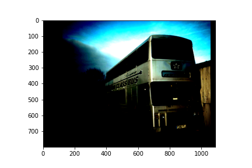
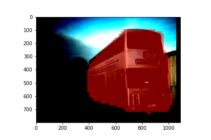
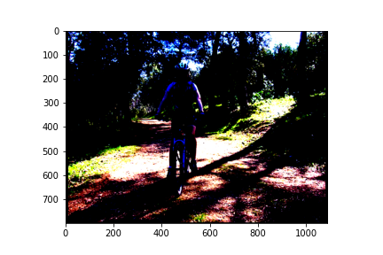
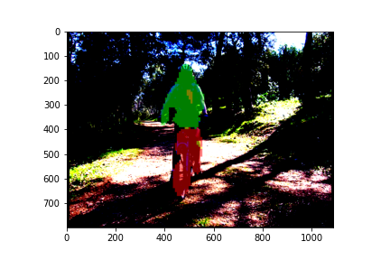
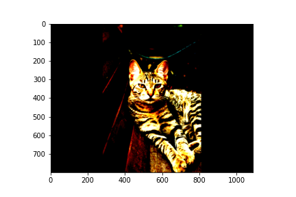
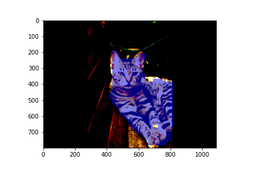

# Segmenting Objects by Location PyTorch Implementation

The project involved the implementation of the instance segmentation algorithm defined in paper: [SOLO](https://arxiv.org/abs/1912.04488). The main idea behind the paper is that different instance categories can be differentiated by their location and size in an image. The image is divided into SxS grids. Each grid cell is responsible for locating the instance's center which falls in the pixels it corresponds to in the original image. Size is handled by detecting at different levels of Feature Pyramid Network.

## Results
     
     
     